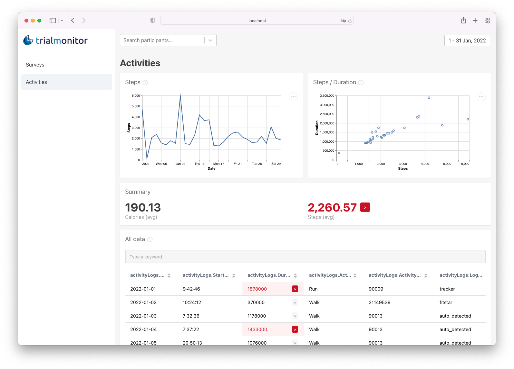

Trial Monitor is a tool that enables developers and researchers to create personalized web dashboards for monitoring participants in technology-enabled field trials. The tool was designed to reduce the work of developing one’s own dashboard, the need to adapt the technology stack to an existing dashboard, or the need to create a different dashboard tool for each project.

Trial Monitor uses simple configuration files to define the connection to different databases, the types of visualizations to be used, and the user interface that researchers will see to make sense of the user-generated data.



## Requirements

Ensure that you have [Node.js](https://nodejs.org/) (tested with v16) or Docker installed on your machine according to your desired setup.

## Getting Started

Trial Monitor can either be installed directly on your machine or used through Docker. In the repository, we provide a config with examples and sample data, as well as Docker files and Docker images for easy deployment.

You can use the published docker images to run Trial Monitor without cloning the repository. To do so, follow these instructions:

1. Download the [config.template](https://downgit.github.io/#/home?url=https://github.com/fraunhoferportugal/trial-monitor/tree/master/config.template) folder.

2. Unzip it and rename `config.template` to `config`.

3. Edit the files in the `config` folder according to the needs of your project. Don't forget to specify the location where the API will run in `api_url` within the `ui-config.json` file.

4. Run the services using docker or docker-compose. Make sure you map the `config` folder as a volume as shown in the following example:

```yaml
version: "3"
services:
  api:
    image: ghcr.io/fraunhoferportugal/trialmonitor-api:latest
    volumes:
      - ./config:/usr/config
    ports:
      - 3001:80
  frontend:
    image: ghcr.io/fraunhoferportugal/trialmonitor-ui:latest
    volumes:
      - ./config/ui-config.json:/usr/share/nginx/html/ui-config.json
    ports:
      - 80:80
```

For this example, the `api_url` within the `ui-config.json` file needs to be `"http://host.docker.internal:3001/api"` (verify if it is correctly configured, more information [here](./05-deployment.md#requirement-docker-configuration-requirement)) or `"http://<domain_name>:3001/api"`.

:::note
Check [here](https://github.com/fraunhoferportugal/trial-monitor/blob/master/docker-compose.yaml) for a more complex example of a docker-compose file. Don't forget to replace `build` property from `api` and `frontend` services with the respective docker images.
:::

## Building from Source

To install Trial Monitor on your machine from the source repository follow the steps below:

1. Clone the repository on your machine

```bash
git clone https://github.com/fraunhoferportugal/trial-monitor.git
```

2. Rename `config.template` to `config`

3. Edit the files in the `config` folder according to the needs of your project

### Running Trial Monitor

To use Trial Monitor directly on your machine just install the dependencies and run the project with `yarn`:

```bash
yarn install
yarn run dev
```

Or you can use the `docker-compose` file:

```bash
# Production
docker-compose -f docker-compose.yaml up

# Development
docker-compose -f docker-compose.dev.yaml up
```

:::note
If you're running Trial Monitor in a VM set the `API_URL` with `http://<ip>/api`.
:::

:::caution

When running with docker in development, you shouldn't install the packages using yarn in your host. The startup script will install the packages for you. If you did, delete the directories: packages/client/node_modules and packages/server/node_modules.

:::

In development mode, Trial Monitor API will run by default on port `3001`, while the UI will run by default on port `8080`. When running in development mode all changes in the config files will be automatically reflected on the interface.

:::info

To run Trial Monitor with authentication check the instructions [here](./05-deployment.md).

:::
