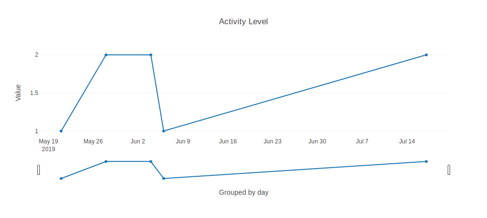
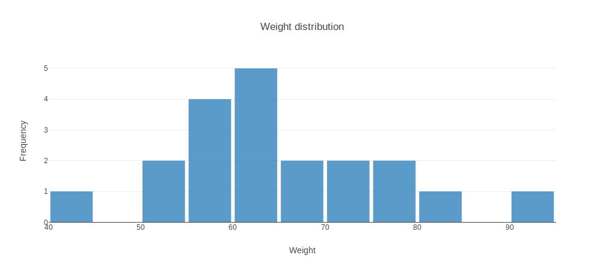
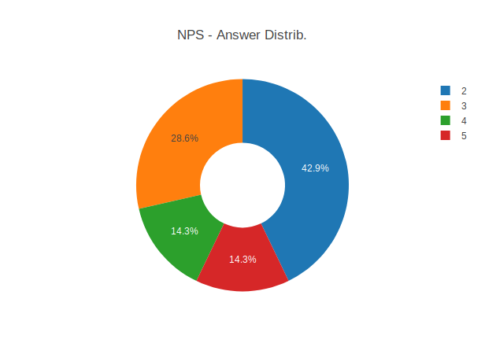
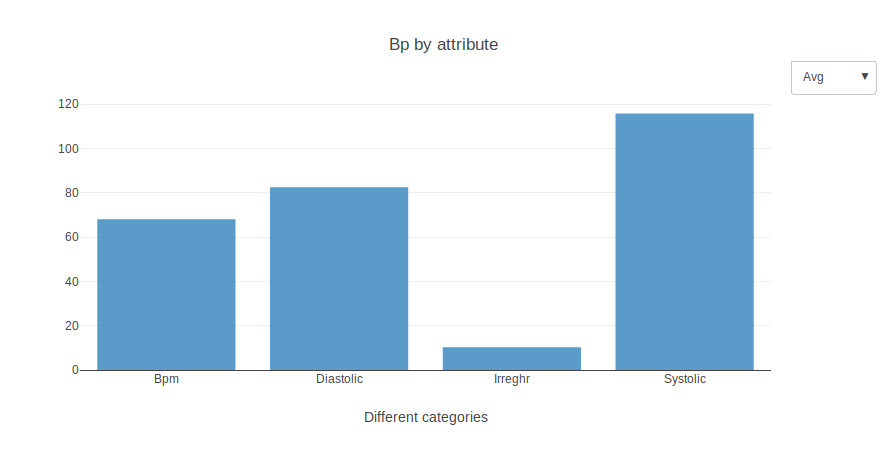

The main purpose of the UI components is to represent data through visual representations. In terms of granularity, they can be divided into two main categories: `cards` and `charts`. The type is defined through the property `type`.

The data needed for these components is specified through the property `specifications`. And in similarity to users, the data retrieved can be filtered through the property [`filters`](../Databases/overview).

```yaml
specifications:
  database: smSQL
  tables: activities
  x: activities.value
  filters:
  - target: value
    operator: '>='
    value: 2400
```

## Cards

Cards provide a summative overview relatively to an attribute.

**Properties:**

- **`title`** - a non empty string representing the header title displayed on the top of the card content.
- **`round`** - `<units>` \| `<u>` \| `<decimals>` \| `<d>` \| `<centesimals>` \| `<c>` **or** an integer representing the number of decimal places.
- **`specifications`** - property that tells the system how to retrieve data.
  - **`database`** - a non-empty string representing the database identifier (only considered when there are multiple database connections).
  - **`datastore`** - (Only for Healthcare API) The name of the datastore where the data is being requested from.
  - **`tables`** - an array of strings (the name of the targeted tables). These tables must be linked, in other words, at some point, one of them references the other. In Fhir databases, this property is the type of Resource being requested.
  - **`x`** - a non-empty string representing the name of the targeted attribute.
  - **`operator`** - `<avg>` \| `<count>` \| `<max>` \| `<min`>.


```yaml
- type: card
  title: Activity Level
  round: 2
  specifications:
      database: lifanaMySQL
      tables: Activity
      x: value
      operator: avg
```

## Charts

Charts are supported essentially to display data in multiple axes, a functionality that could not be addressed by the [first component](#cards), therefore appearing as complementation.

In total there are **four** different charts that can be used being: `timeseries, barchart, pie/doughnut chart, histogram`.

### Time series

Time series allows tracking a specific attribute over time because the x-axis reflects the time and the y-axis the corresponding value registered.

**Properties:**

- **`title`** - a string that represents the chart title (**optional**).
- **`ylabel`** - a string that represents the y-axis label name (**optional**).
- **`xlabel`** - a string that represents the x-axis label name (**optional**).
- **`yrange`** - a property to define the lower and upper y-axis limit.
  - **`beginning`** - an integer establishing the lower limit.
  - **`end`** - an integer establishing the upper limit.
- **`specifications`** - property that tells the system how to retrieve data.
  - **`database`** - a non-empty string representing the database identifier (only considered when there are multiple database connections).
  - **`datastore`** - (Only for Healthcare API) The name of the datastore where the data is being requested from.
  - **`tables`** - an array of strings (the name of the targeted tables). These tables must be linked, in other words, at some point, one of them references the other. In Fhir databases, this property is the type of Resource being requested.
  - **`x`** - a non-empty string representing the attribute to be represented on the x-axis.
  - **`y`** - a non-empty string representing the attribute to be represented on the y-axis.
  - **`groupby`** - a property used to group the time according to a specific value based on an operator.
    - **`time`** - `<hour>` \| `<day>` \| `<week>` \| `<month>`.
    - **`operator`** - `<avg>` \| `<count>` \| `<max>` \| `<min`>



```yaml
- type: timeseries
  title: Meal plans created
  ylabel: Value
  xlabel: Grouped by day
  yrange:
    beginning: 0
    end: 6
  specifications:
    database: lifanaMySQL
    tables: WeekPlan
    x: beginDate
    y: WeekPlan.Household_idHousehold
    groupby:
      time: day
      operator: count
```

### Histogram

A histogram is a valuable representation when it comes to represent and analyse the frequency of a determined attribute.

**Properties:**

- **`title`** - a string that represents the chart title (**optional**).
- **`ylabel`** - a string that represents the y-axis label name (**optional**).
- **`xlabel`** - a string that represents the x-axis label name (**optional**).
- **`interval`** - a property to define the x-axis interval.
  - **`start`** - an integer representing the left most limit.
  - **`end`** - an integer representing the right most limit.
  - **`size`** - an integer representing the length in the x-axis.
- **`specifications`** - property that tells the system how to retrieve data.
  - **`database`** - a non-empty string representing the database identifier (only considered when there are multiple database connections).
  - **`datastore`** - (Only for Healthcare API) The name of the datastore where the data is being requested from.
  - **`tables`** - an array of strings (the name of the targeted tables). These tables must be linked, in other words, at some point, one of them references the other. In Fhir databases, this property is the type of Resource being requested.
  - **`x`** - a non-empty string representing the attribute to be represented on the x-axis.



```yaml
- type: histogram
  title: Weight distribution
  ylabel: Frequency
  xlabel: Weight
  interval:
    start: 0
    end: 150
    size: 5
  specifications:
    database: lifanaMySQL
    tables: WeightLog
    x: weightKg
```

### Pie Chart

Pie charts permit us to compare categories in terms of the proportion of their frequency. In such cases, since the arc length is proportional to the frequency, it evidences, the proportions to one another.

**Properties:**

- **`title`** - a string that represents the chart title (**optional**).
- **`subtype`** - `<donut>` \| `<pie>`
- **`specifications`** - property that tells the system how to retrieve data.
  - **`database`** - a non-empty string representing the database identifier (only considered when there are multiple database connections).
  - **`datastore`** - (Only for Healthcare API) The name of the datastore where the data is being requested from.
  - **`tables`** - an array of strings (the name of the targeted tables). These tables must be linked, in other words, at some point, one of them references the other. In Fhir databases, this property is the type of Resource being requested.
  - **`x`** - a non-empty string representing the attribute to be represented.



```yaml
- type: piechart
  subtype: donut
  title: NPS - Answer Distrib.
  specifications:
    database: lifanaFirebase
    tables: SurveyNps
    x: answer
```

### Barchart

Commonly there is data that can be classified as categorical thus, those same categories are used to aggregate information among them based on a specific operator in which ultimately, are represented along one of the axis (in this case x-axis).

**Properties:**

- **`title`** - a string that represents the chart title (**optional**).
- **`domain`** - `<categorical>` \| `<temporal>` | `<day>`
- **`labels`** - `<direct>` (**optional**)
- **`ylabel`** - a string that represents the y-axis label name (**optional**).
- **`xlabel`** - a string that represents the x-axis label name (**optional**).
- **`specifications`** - property that tells the system how to retrieve data.

  - **`database`** - a non-empty string representing the database identifier (only considered when there are multiple database connections).
  - **`datastore`** - (Only for Healthcare API) The name of the datastore where the data is being requested from.
  - **`tables`** - an array of strings (the name of the targeted tables). These tables must be linked, in other words, at some point, one of them references the other. In Fhir databases, this property is the type of Resource being requested.
  - **`x`** - assumes either:
    - (1) a non-empty string representing an attribute.
    - (2) a non-empty string representing an attribute that is an enumeration variable (e.g. color, assuming color values as `red`, `blue`, `green`).
    - (3) an array of strings corresponding to the categories (In some cases a tuple from a table contain multiple attributes that are categories, that's why we use this).
  - **`y`** - assumes either:

    - a non-empty string
    - `IS_COUNT` to act as a Histogram. Consequently, the `x` defined is variable corresponding to an enumeration.
    - **It is not declared in case `x` takes a scenario (3)**.

  - **`groupby`** - a property used to group the time according to a specific value based on an operator (**only needed if `domain` set to `temporal`**).
    - **`time`** - `<hour>` \| `<day>` \| `<week>` \| `<month>`.
    - **`operator`** - `<avg>` \| `<count>` \| `<max>` \| `<min`>.



```yaml
- type: barchart
  domain: categorical
  title: Bp by attribute
  ylabel: Value
  xlabel: Different categories
  categories:
    - Bpm
    - Diastolic
    - Irreghr
    - Systolic
  specifications:
    database: conventional
    table: Bp
    x:
      - bpm
      - diastolic
      - irreghr
      - systolic
```

## Table

**Properties:**

- **`title`** - a string that represents the table title (**optional**).
- **`export`** - `<true>` \| `<false>` (**optional**) Default: false. Allow users to export an CSV with the table data.
- **`pagination`** - `<true>` \| `<false>` \ `<integer>` (**optional**) Allows users to disable the pagination or to change the number of rows per page. By default pagination is enable with 20 rows per page.
- **`search`** - `<true>` \| `<false>` (**optional**).  Default: true.
- **`sort`** - `<true>` \| `<false>` (**optional**). Default: true.
- **`specifications`** - property that tells the system how to retrieve data.
  - **`database`** - a non-empty string representing the database identifier (only considered when there are multiple database connections).
  - **`datastore`** - (Only for Healthcare API) The name of the datastore where the data is being requested from.
  - **`tables`** - an array of strings (the name of the targeted tables). These tables must be linked, in other words, at some point, one of them references the other. In Fhir databases, this property is the type of Resource being requested.
  - **`attributes`** - a list of non-empty strings representing the attributes to be represented.


```yaml
- type: table
  title: Custom ingredients
  specifications:
    database: lifanaMySQL
    tables: [ShoppingListCustomItem, ShoppingList]
    attributes: [name]
```


<!-- ## Map
TODO: We need to test this

The map component provides a map with markers.

**Properties:**

- **`specifications`** - property that tells the system how to retrieve data.
  - **`database`** - a non-empty string representing the database identifier.
  - **`document`** - a name that it's recognized by the back-end to retrieve data in the following format `[{latitude, longitude, time?, accuracy?}, {...}, ...]` (list of markers).
 -->
