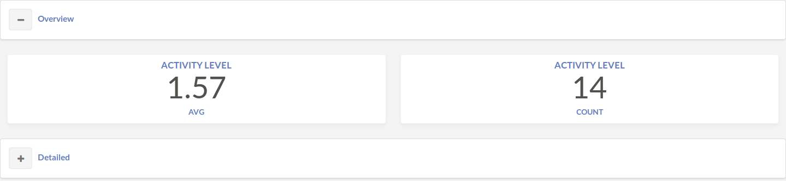

By configuring the layout, the user has control over on how the components are organized and displayed to the user. To keep it simple, the concepts adopted are `section` and `rows`. 

Both concepts must include as a property, either `numChilds` or `children`. `numChilds` is used whenever the child components are UI components (e.g. charts, card) assuming an integer as its value. `children` in case its children are other layout components, assuming an array of layout components as its value.

With that being said, it is possible to have nested layout components just as
~~~~
 - section:
     header: Overview
     children:
        - section:
            header: Received Feedback
            children: 
                ...
~~~~

### Section

A `section` is a layout component that wraps content and that can either be expanded or contracted. **Note:** It must at all times have a property `headers` defined which must be unique for each page.

~~~
- section:
    header: Overview 
    numChilds: 2
- section:
    header: Detailed 
~~~

### Row

A row is part of a grid system and supports additional properties such as `small`, `medium` in order to define the number of colums for distinct screen sizes. 

~~~~
    children:
      - row:
          numChilds: 3
          small: 1
          medium: 2
~~~~

The first being used for mobile screens and the second for medium sized computer screens. For the case `numChilds` is also defined, it is used for larger screens.

